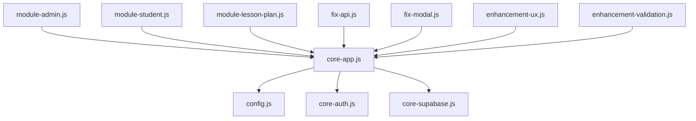

# 📁 Project Structure Guide

> Claude 기반 프로젝트 관리를 위한 체계적인 구조 가이드

## 🎯 설계 원칙

1. **명확한 모듈 분리**: 기능별로 명확하게 분리된 구조
2. **의존성 투명성**: 각 모듈간 의존관계가 명확
3. **업데이트 용이성**: 특정 기능만 독립적으로 수정 가능
4. **문서화 우선**: 모든 변경사항이 추적 가능

## 📂 디렉토리 구조

```
/
├── docs/                    # 📚 문서화
│   ├── api/                # API 문서
│   ├── components/         # 컴포넌트 문서
│   └── updates/           # 업데이트 로그
├── src/                    # 🔧 소스 코드
│   ├── core/              # 핵심 시스템
│   ├── modules/           # 기능 모듈
│   ├── fixes/             # 버그 수정
│   └── enhancements/      # 개선 사항
├── config/                 # ⚙️ 설정 파일
└── tests/                  # 🧪 테스트 파일
```

## 🔧 파일 명명 규칙

### CSS 파일
- `core-*.css`: 핵심 스타일
- `module-*.css`: 기능별 스타일
- `fix-*.css`: 버그 수정 스타일
- `enhancement-*.css`: UX/UI 개선

### JavaScript 파일
- `core-*.js`: 핵심 로직
- `module-*.js`: 기능별 로직
- `fix-*.js`: 버그 수정 로직
- `util-*.js`: 유틸리티 함수

## 📋 모듈 의존성 맵



## 🎯 Claude 업데이트 가이드

1. **파일 수정 시**: 관련 문서 먼저 확인
2. **새 기능 추가**: `modules/` 디렉토리에 추가
3. **버그 수정**: `fixes/` 디렉토리에 추가
4. **개선사항**: `enhancements/` 디렉토리에 추가

## 📝 업데이트 체크리스트

- [ ] 관련 문서 업데이트
- [ ] 의존성 확인
- [ ] 테스트 케이스 작성
- [ ] 변경 로그 기록
