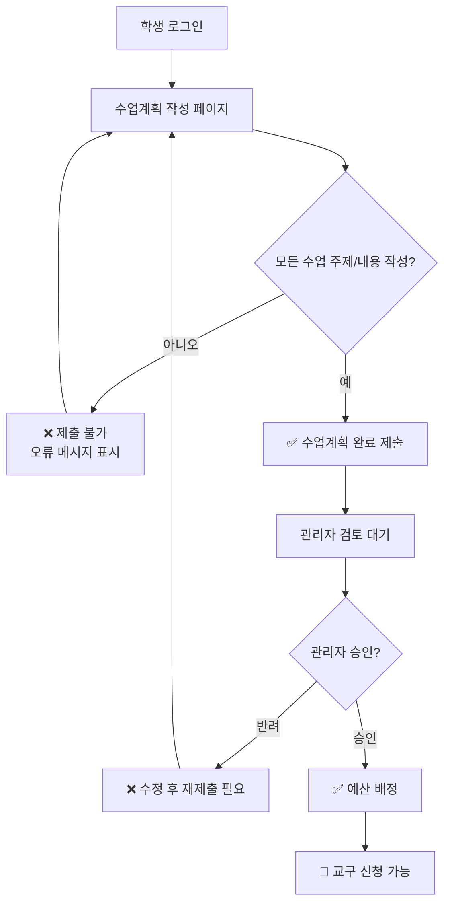

# 세종학당 문화교구 신청 플랫폼

## 🚀 최근 업데이트 (2025-06-13)

### 📋 수업계획 필수 제출 강화

**주요 변경사항:**
- ✅ **수업계획을 필수 제출 사항으로 변경**: 교구 신청을 위해서는 반드시 수업계획을 작성하고 관리자 승인을 받아야 함
- ✅ **default_lessons_per_week 설정 완전 제거**: 불필요한 "주당 평균 수업 횟수" 설정 삭제
- ✅ **UI/UX 개선**: 수업계획의 필수성을 명확하게 표시하고 사용자 안내 강화
- ✅ **데이터베이스 검증 로직 추가**: 수업계획 완성도 검사 및 교구 신청 전 승인 상태 확인

### 🔧 상세 변경 내용

#### 1. 수업계획 필수화
- **기존**: 수업계획은 "선택사항"으로 안내
- **변경**: 수업계획은 "필수 제출 사항"으로 변경
- **영향**: 수업계획이 승인되지 않으면 교구 신청 버튼이 비활성화됨

#### 2. UI 개선사항
- 📱 **수업계획 작성 페이지**:
  - 헤더에 "필수적으로 작성해주세요" 메시지 추가
  - 각 수업의 주제/내용 입력란에 "(필수)" 표시
  - 플레이스홀더에 "반드시 입력하세요" 문구 추가
  
- 📱 **학생 대시보드**:
  - 수업계획 버튼에 "(필수)" 표시
  - 예산 상태에 "수업계획 승인 후 예산이 배정됩니다 (필수)" 메시지
  - 교구 신청 버튼 툴팁에 필수성 안내

#### 3. 데이터베이스 강화
- 🗄️ **새로운 검증 함수들**:
  - `validate_lesson_plan_completion()`: 수업계획 완성도 검증
  - `check_lesson_plan_approval()`: 교구 신청 전 승인 상태 확인
  
- 🗄️ **트리거 추가**:
  - 수업계획 제출 시 완성도 자동 검증
  - 교구 신청 시 수업계획 승인 상태 자동 확인

#### 4. 제거된 기능
- ❌ **default_lessons_per_week 설정**: 완전 제거
- ❌ **주당 평균 수업 횟수 입력 필드**: UI에서 제거
- ❌ **관련 계산 로직**: 코드에서 완전 삭제

### 🔍 수업계획 필수 제출 프로세스



### 📱 새로운 사용법

#### 학생용

1. **로그인**: 이름과 생년월일로 로그인

2. **수업계획 작성 (필수)**:
   - ⚠️ **필수 단계**: 교구 신청을 위해 반드시 완료해야 함
   - 파견 기간과 총 수업 횟수 입력
   - "수업 계획표 생성" 버튼 클릭
   - **모든 수업의 주제와 내용을 반드시 작성** (빈 칸 있으면 제출 불가)
   - "임시 저장" 또는 "수업 계획 완료 및 제출" 클릭

3. **관리자 승인 대기**:
   - 수업계획 제출 후 관리자 승인 대기
   - 승인되면 자동으로 예산 배정

4. **교구 신청**: 수업계획 승인 및 예산 배정 후에만 가능

#### 관리자용

1. **로그인**: 관리자 코드로 로그인

2. **수업계획 관리**:
   - "수업계획 관리" 버튼에서 제출된 계획 확인
   - 각 수업의 주제와 내용을 검토하여 승인/반려 결정
   - 반려 시 구체적인 사유 입력

3. **교구 신청 관리**: 수업계획이 승인된 학생들의 교구 신청 처리

4. **예산 설정**: 분야별 회당 지원금 및 최대 상한 설정

5. **시스템 설정**: 수업계획 마감일 등 설정

## 🔧 이전 업데이트 (2025-06-13 - 수업계획 저장 문제 해결)

### 수업계획 저장 문제 해결

**문제점:**
- 수업계획 저장 시 "수업계획 저장 중 오류가 발생했습니다" 메시지가 나타나며 저장이 실패하는 문제

**원인:**
- Supabase RLS (Row Level Security) 정책이 `auth.uid()`를 사용하도록 설정되어 있었는데, 이 애플리케이션은 Supabase Auth를 사용하지 않고 자체 인증 시스템을 사용함
- `auth.uid()`가 항상 null을 반환하여 모든 데이터베이스 작업이 차단됨

**해결 방법:**
1. **RLS 정책 제거 및 비활성화**: 모든 테이블에서 RLS를 비활성화하여 자체 인증 시스템이 정상 작동하도록 수정
2. **Supabase 클라이언트 개선**: 더 나은 에러 핸들링과 디버깅 로그 추가
3. **수업계획 관리자 강화**: 상세한 디버깅 로그와 에러 메시지 개선
4. **테스트 모드 활성화**: 수업계획 편집 제한을 해제하여 언제든지 테스트 가능

## 🔍 문제 해결 가이드

### 수업계획 작성 관련 문제

1. **"모든 수업의 주제와 내용을 입력해주세요" 오류**:
   - 모든 수업 회차의 주제와 내용을 빈 칸 없이 작성해야 함
   - 임시저장은 가능하지만 완료 제출을 위해서는 모든 필드 필수

2. **"수업계획 승인 후 신청 가능합니다" 메시지**:
   - 수업계획을 완료 제출하고 관리자 승인을 받아야 함
   - 관리자에게 승인 요청 연락

3. **브라우저 개발자 도구 확인**:
   ```
   F12 → Console 탭에서 로그 메시지 확인
   ```

### 관리자용 디버깅 명령어

개발자 도구 콘솔에서 다음 명령어들을 사용할 수 있습니다:

```javascript
// API 연결 테스트
await SupabaseAPI.testConnection()

// 현재 사용자 정보 확인
AuthManager.getCurrentUser()

// 시스템 설정 확인
await SupabaseAPI.getSystemSettings()

// 테스트 모드 토글 (Ctrl+T)
await SupabaseAPI.toggleTestMode()
```

## ⚙️ 기술 스택

- **Frontend**: HTML5, CSS3, JavaScript (Vanilla)
- **Backend**: Supabase (PostgreSQL)
- **Authentication**: 자체 구현 (이름 + 생년월일)
- **Deployment**: GitHub Pages 호환

## 🛠️ 개발 환경 설정

### 로컬 개발

1. 저장소 클론:
   ```bash
   git clone https://github.com/faye8796/request.git
   cd request
   ```

2. 로컬 서버 실행:
   ```bash
   # Python 3
   python -m http.server 8000
   
   # 또는 Node.js
   npx serve .
   ```

3. 브라우저에서 접속:
   ```
   http://localhost:8000
   ```

### Supabase 설정

1. **프로젝트 정보**:
   - URL: `https://aazvopacnbbkvusihqva.supabase.co`
   - 프로젝트명: `sejong-cultural-request`

2. **데이터베이스 스키마**:
   - `database/schema.sql`: 초기 스키마
   - `database/fix_rls_policies.sql`: RLS 정책 수정
   - `database/lesson_plan_required_migration.sql`: 수업계획 필수화 마이그레이션

3. **환경 변수**:
   - `SUPABASE_URL`: Supabase 프로젝트 URL
   - `SUPABASE_ANON_KEY`: 익명 키

## 📝 버전 히스토리

### v2.2.0 (2025-06-13) - 수업계획 필수화
- 📋 **수업계획 필수 제출 강화**: 교구 신청을 위한 필수 조건으로 변경
- ❌ **default_lessons_per_week 설정 제거**: 불필요한 주당 수업 횟수 설정 삭제
- 🎨 **UI/UX 개선**: 필수성 강조 및 사용자 안내 메시지 추가
- 🗄️ **데이터베이스 검증 로직 추가**: 완성도 검사 및 승인 상태 확인 자동화

### v2.1.0 (2025-06-13) - 저장 문제 해결
- 🐛 수업계획 저장 문제 해결
- 🔧 RLS 정책 수정
- 📈 디버깅 도구 추가
- 🧪 테스트 모드 활성화

### v2.0.0 (이전)
- 🚀 Supabase 연동
- 📱 반응형 UI 개선
- 🔐 보안 강화

## 🆘 지원

문제가 발생하면:

1. **Issue 등록**: GitHub Issues에 문제 상황 상세히 기록
2. **로그 첨부**: 브라우저 개발자 도구의 Console 로그 캡처
3. **재현 단계**: 문제 발생 단계를 순서대로 기록

## ⚠️ 중요 공지

**수업계획 작성은 이제 필수 사항입니다!**

- 🚨 교구 신청을 위해서는 반드시 수업계획을 완료 제출하고 관리자 승인을 받아야 합니다
- 📝 모든 수업의 주제와 내용을 구체적으로 작성해야 제출이 가능합니다
- ⏰ 수업계획 마감일을 준수하여 제때 제출해주세요
- 🔄 반려된 경우 사유를 확인하고 즉시 수정하여 재제출해주세요

---

**개발자**: faye8796  
**라이선스**: MIT  
**최종 업데이트**: 2025-06-13 v2.2.0
